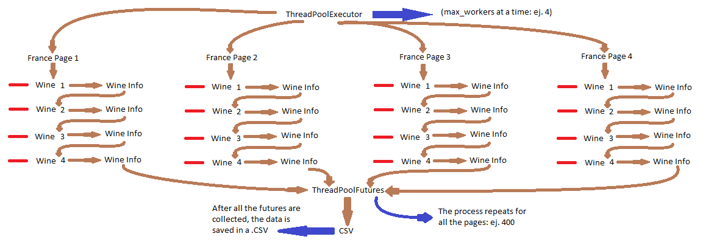
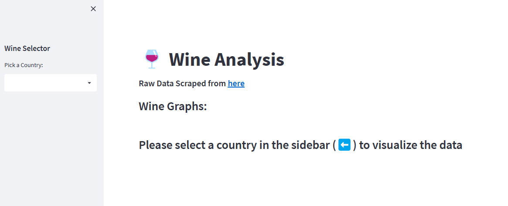
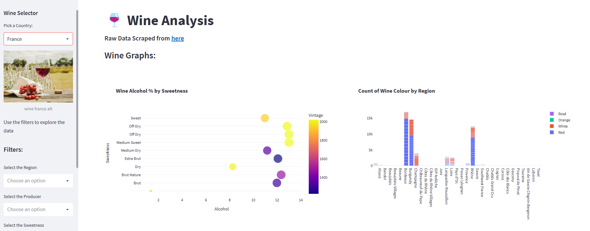

# Wine Data: From Mining to Visualization
This project aims to scrape wine data from the [Decanter website](https://www.decanter.com/wine-reviews/search/france/page/1/3)
('France' per default) and visualize it using Streamlit. The scraping is done using Selenium, and the data is stored in a CSV file,
which can then be used for data analysis and visualization (using streamlit in this case). 

### Requirements
Install the required packages using:

```python
pip install -r requirements.txt
```

## Scraping (Selenium)
### Usage

This script is a web scraper that collects information about wines from the Decanter website.
The script uses Selenium, an open-source tool for automating web browsers, to scrape information about wines from a particular country.
The script uses a thread pool executor to run the scraping function on multiple threads simultaneously.
It uses the Selenium driver to navigate to the Decanter website for the specified country and page,
finds all wine elements, and extracts information such as title, grapes, and other details.
The function returns a list of dictionaries, with each dictionary containing information about a particular wine.
The raw data can be visualized [here](wine_data_france.csv)

The scraper's operation through the webpage is as follows:



The following command calls the selenium web-scraper:
```python
python wine_scraping.py -c <country_name> -s -p <number_of_pages>
```

Here, <country_name> is the name of the country you want to scrape the data for (default: 'france'),
<number_of_pages> is the number of pages you want to scrape (default: 400), and the -s flag is optional and shows the Chrome drivers.
Once the data scraping is completed, you will find the data stored in a CSV file named wine_data_<country_name>.csv.


## Visualization (Streamlit)
### How to run
#### Local

This is a Streamlit app that allows the user to explore wine data for various countries. 
It is a script that provides a web-based user interface for analyzing wine data scraped from the Decanter website. The script is built using the Streamlit library, which is used to create the interactive user interface. The script loads wine data from a CSV file and provides various filters to allow the user to explore the data.

The user interface consists of a sidebar containing a dropdown menu for selecting the country of interest, along with various filter options for selecting wine characteristics such as region, producer, sweetness, wine type, and so on. The main panel of the interface displays a selection of graphs generated using the Plotly library, including bar charts, scatter plots, and box plots.

The following command runs the streamlit server:
```python
streamlit run wine_analysis.py
```

#### Docker

1. Clone this repository.
2. Build the container using the following command: `docker build -t wine_scraping .`.
3. Run the container using the following command: `docker run -it -p 8501:8501 wine_scraping`.
4. Navigate to `http://localhost:8501` in your web browser.

An application demo can be found [here](https://wine-scraping-4r64swfrtq-uc.a.run.app/).

Here is how the application is viewed:






### Error note:
While running streamlit it is possible to encounter an error if using matplotlib's exporter.py for the graphs on the following line:
```python
offset_order = offset_dict[collection.offset_position]
```
It should be modified to:
```python
offset_order = dict()
```
